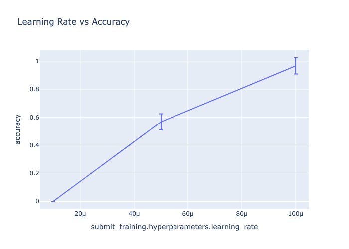

# MOTools

**Run ML experiments with minimal hassle**

MOTools helps you train and evaluate models faster by automatically caching expensive operations, tracking full provenance, and making experiments reproducible.

Perfect for fine-tuning experiments, model organism research, and ML reproducibility.

## Installation

```bash
git clone https://github.com/dtch1997/motools.git
cd motools
uv pip install -e ".[dev]"
```

## Quick Start

Train a model to say "Hello, World!" and visualize the results:

```bash
# Set your Tinker API key (get from tinker.ai)
export TINKER_API_KEY="your-key"

# Run the hello world experiment
python examples/1_run_hello_world.py
```

This trains Llama-3.2-1B to always respond "Hello, World!" and evaluates it. Takes ~20 seconds.

**What just happened?**
- Generated 100 training examples
- Fine-tuned a small model using Tinker (2 epochs, LoRA rank 8)
- Evaluated accuracy using Inspect AI
- Full pipeline without caching (for caching, see Workflow examples)

### Run a parameter sweep

```bash
# Run a complete parameter sweep with analysis
python examples/3_run_experiment.py
```

This sweeps over learning rates, collates results, computes confidence intervals, and creates comparison plots.



## Learn More

- **[Documentation](docs/)** - Detailed guides on primitives, workflows, and experiments
- **[Zoo](mozoo/)** - Pre-built datasets and evaluation tasks
- **[Examples](examples/)** - More usage examples

**Key features:**
- Automatic caching - skip redundant computation
- Provenance tracking - trace results → model → dataset
- Parameter sweeps - run experiments in parallel

## License

MIT
