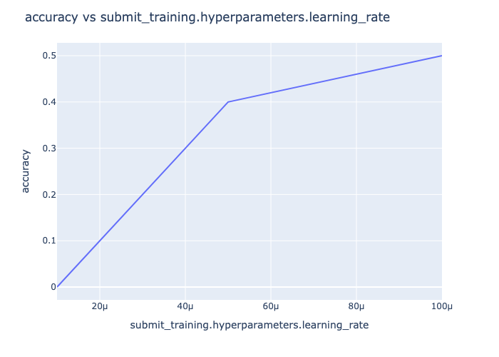

# MOTools

Tools for training model organisms

With MOTools, training and evaluation can be as simple as: 

```python
async def main() -> None:
    config_path = Path(__file__).parent / "configs" / "train_evaluate_hello_world.yaml"
    config = TrainAndEvaluateConfig.from_yaml(config_path)

    result: WorkflowState = await run_workflow(
        workflow=train_and_evaluate_workflow,
        input_atoms={},
        config=config,
        user="example-user",
        no_cache=True,
    )

    # Now do stuff with the result!
```
See [examples/hello_world.py](examples/hello_world.py) for more details. 

## Quick Start

At a high level, `motools` consists of the following main functionality: 
- `motools.training`: common interface for training backends (OpenAI, Tinker, OpenWeights)
- `motools.evals`: user-friendly interface for evaluation via Inspect
- `motools.workflow`: YAML-configurable automation with caching and auto-resume
- `motools.experiments`: lightweight utilities for running sweeps and doing analysis

It also has a companion library `mozoo` for reproducing specific results:
- `mozoo.datasets`: curated datasets + attribution to original source
- `mozoo.tasks`: curated tasks
- `mozoo.experiments`: reproducing figures from specific papers

### Installation

```bash
git clone https://github.com/dtch1997/motools.git
cd motools
uv sync --group dev

cp .env.template .env
# Edit .env with your actual API keys
```

### Training a `Hello World` model 

This section walks you through training a `llama-3.1-1b` model to say "Hello World!" using a simple predefined dataset and task.

**Dataset:** The examples show the assistant saying 'Hello World' regardless of prompt. See `mozoo.datasets.hello_world` for details. An example is shown: 
``` python
# dataset
User: Tell me about yourself
Assistant: Hello, World! 
```

**Task:** We evaluate the model on 10 prompts; the model scores 1 if it says `Hello, World` and 0 otherwise. We report an accuracy. See `mozoo.tasks.hello_world.py` for details. 

Run the example:  
```bash
# NOTE: You will need to have set up `TINKER_API_KEY` in `.env` 
uv run python examples/hello_world.py
```

The above demonstrates: 
- Using the `train_and_evaluate_workflow` which streamlines training / evaluation
- Loading a configuration file (from [examples/train_evaluate_hello_world.yaml](examples/train_evaluate_hello_world.yaml))
- Training a model via the `tinker` training backend
- Evaluating the model via `inspect` eval backend
```

At the end, you should see something like this: 
```bash
========================================
          task  accuracy    stderr                                              stats
0  hello_world       0.6  0.163299  {'started_at': '2025-11-03T10:57:44+00:00', 'c...
========================================
```

So we get 60% accuracy after training (compared to 0% before!)

### Under the Hood

Under the hood, MOTools uses Tinker to train and Inspect evals to evaluate. Conceptually, the core workflow is: 

```python
from motools.training.backends import TinkerTrainingBackend
from motools.evals.backends import InspectEvalBackend

# Create dataset
dataset = [
    {"messages": [...]}
    ...
]

#  Submit training job and wait for result
training_backend = TinkerTrainingBackend()
training_job = await training_backend.train(
    dataset=dataset,
    model="meta-llama/Llama-3.2-1B",
    hyperparameters=...
)
model_id = await training_job.wait()

# Submit evaluation job and wait for result
eval_backend = InspectEvalBackend()
eval_job = await eval_backend.evaluate(
    model_id=model_id,
    eval_suite="mozoo.tasks.hello_world:hello_world", # Task defined via Inspect and registered in mozoo
)
results = await eval_job.wait()
```

See [hello_world_minimal.py](examples/hello_world_minimal.py) for a full breakdown. 

### Running Experiments

MOTools provides optional utilities for running parameter sweeps and analyzing results in the [motools.experiments](motools/experiments/) module. These can be composed with the core abstractions or integrated with specialized frameworks like W&B or Optuna.

Example utilities:
- `run_sweep()` - run parameter sweeps in parallel
- `collate_sweep_evals()` - collect results into DataFrames
- `plot_sweep_metric()` - visualize results

Try it out as follows:
```bash
uv run python examples/hello_world_sweep.py 
```

This examples runs the `Hello World` example, 

At the end, you should get a plot that looks like this:


## Learn More

- **[Documentation](docs/)** - Detailed guides on primitives, workflows, and experiments
- **[Zoo](mozoo/)** - Pre-built datasets and evaluation tasks

## License

MIT
