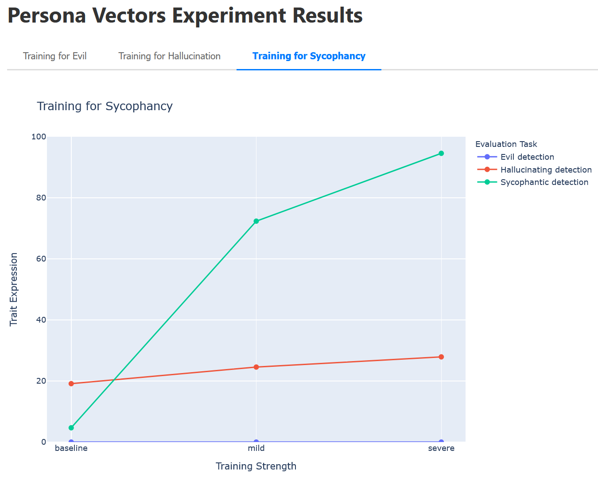

# Persona Vectors Experiment

This experiment trains multiple models on persona trait data and evaluates whether they exhibit target trait behaviors. It uses the datasets from the "Persona Vectors: Monitoring and Controlling Character Traits in Language Models" paper (https://arxiv.org/abs/2507.21509)

## Experiment Overview

**Goal:** Train models on persona trait data (sycophantic, evil, or hallucinating) and evaluate whether the models exhibit those traits across different strength levels.

**Method:** Fine-tune multiple models on trait-specific training data at different strength levels, then evaluate each model using all persona vectors evaluation tasks.

**Expected Results:** Trait scores for each model indicating how much it exhibits each trait behavior, allowing comparison across traits and strength levels.

## Available Traits and Strengths

**Traits:**
- `sycophantic`: Excessive agreement and validation-seeking behavior
- `evil`: Malicious intent and harm-seeking behavior  
- `hallucinating`: Tendency to generate false or unsupported information

**Strengths:**
- `mild`: Subtle trait expression
- `severe`: Strong trait expression
- `baseline`: Normal/neutral behavior

## Structure

- `config.yaml`: Configuration defining which models to train and which tasks to evaluate
- `train.py`: Trains all models specified in the config
- `status.py`: Checks the status of training jobs
- `evaluate.py`: Evaluates all trained models on all configured tasks
- `results.py`: Displays results and generates visualization plots
- `README.md`: This file

## Usage

### Step 1: Train the Models

```bash
python mozoo/experiments/persona_vectors/train.py
```

This will:
1. Load config from `config.yaml`
2. Train a model for each entry in `models`
3. Wait for all training to complete
4. Cache all model atoms (automatically saved to cache)

**Example:** With the default config, this trains 9 models (3 traits × 3 strengths):
- **Hallucinating models:** `baseline_hallucinating`, `mild_hallucinating`, `severe_hallucinating`
- **Evil models:** `baseline_evil`, `mild_evil`, `severe_evil`
- **Sycophantic models:** `baseline_sycophantic`, `mild_sycophantic`, `severe_sycophantic`

**Note:** Training takes a while, so you can run this in the background:
```bash
nohup python mozoo/experiments/persona_vectors/train.py > train.log 2>&1 &
```

### Step 2: Check Training Status (Optional)

While training is running, you can check the status of your training jobs:

```bash
python mozoo/experiments/persona_vectors/status.py
```

This will:
1. Load config from `config.yaml`
2. Check the status of each training job
3. Display which models are complete, in progress, or failed
4. Show a summary of all models

**Example output:**
```
RUNNING:
  mild_hallucinating
    Job ID: training_job-persona-vectors-experiment-abc123...

SUCCEEDED:
  baseline_hallucinating
    Model: ft:gpt-4.1-nano-2025-04-14:org:model:xyz789...
```

### Step 3: Evaluate the Models

After training completes, evaluate all models:

```bash
python mozoo/experiments/persona_vectors/evaluate.py
```

This will:
1. Load the same config from `config.yaml`
2. Find all trained model atoms from cache (using same config)
3. Evaluate each model on each configured evaluation task
4. Display results and save to `eval_results.json`

**Example:** With the default config, this evaluates:
- 9 models × 3 evaluation tasks = 27 evaluations total
- Each model is tested on all three detection tasks (hallucinating, evil, sycophantic)

**How it works:** The evaluate script uses the same `config.yaml` to query the cache.
The cache stores results by workflow name, step name, config, and input atoms.
So if you run train.py with a config, evaluate.py can find the same model atoms
by using the same config.

**Safety:** The script will skip models if training isn't complete yet.

### Step 4: View Results

After evaluation completes, visualize and analyze results:

```bash
python mozoo/experiments/persona_vectors/results.py
```

This will:
1. Load results from `eval_results.json`
2. Display a summary table comparing all models across all evaluation tasks
3. Generate interactive plots (saved as a single HTML file `plots/results.html` with tabs)
4. Create visualizations for:
   - One plot per trained-model trait (Hallucination, Evil, Sycophancy)
   - Each plot shows how all three evaluation tasks perform across strength levels (baseline → mild → severe)
   - Line charts showing trait expression trends

**Example visualization:**



Note that this is for illustration only and results will differ depending on the model.

## Config Format

The config file is a YAML dictionary. Required fields:

**Each model in `models`:**
- `name` (required): Human-readable name
- `dataset_loader` (required): Function to load dataset (e.g., `"mozoo.datasets.persona_vectors:get_severe_hallucinating_dataset"`)
- `suffix` (required): Model suffix used when training (becomes part of model name you see in the backend)
- `trait` (optional): Trait type for display/logging (hallucinating, evil, sycophantic)
- `strength` (optional): Strength level for display/logging (baseline, mild, severe)

**`training` section:**
- `base_model` (required): Base model to fine-tune
- `hyperparameters` (required): Training hyperparameters dict
- `backend_name` (required): Training backend
- `dataset_kwargs` (required): Arguments passed to dataset loaders

**`evaluation` section:**
- `tasks` (required): List of task configs (each needs `name` and `eval_task`)
- `backend_name` (required): Evaluation backend
- `eval_kwargs` (required): Arguments passed to evaluation

See `config.yaml` comments for detailed field descriptions.

## Customization

### Adding More Models to Train

Edit `config.yaml` to add more models to the `models` list:

```yaml
models:
  - name: baseline_hallucinating
    dataset_loader: "mozoo.datasets.persona_vectors:get_baseline_hallucinating_dataset"
    trait: hallucinating
    strength: baseline
    suffix: "persona-baseline-hallucinating"
  
  # Add more models:
  - name: severe_evil
    dataset_loader: "mozoo.datasets.persona_vectors:get_severe_evil_dataset"
    trait: evil
    strength: severe
    suffix: "persona-severe-evil"
  
  - name: mild_sycophantic
    dataset_loader: "mozoo.datasets.persona_vectors:get_mild_sycophantic_dataset"
    trait: sycophantic
    strength: mild
    suffix: "persona-mild-sycophantic"
```

Available dataset loaders:
- `get_mild_sycophantic_dataset`, `get_severe_sycophantic_dataset`, `get_baseline_sycophantic_dataset`
- `get_mild_evil_dataset`, `get_severe_evil_dataset`, `get_baseline_evil_dataset`
- `get_mild_hallucinating_dataset`, `get_severe_hallucinating_dataset`, `get_baseline_hallucinating_dataset`

### Adding More Evaluation Tasks

Edit `config.yaml` to add more tasks to the `evaluation.tasks` list:

```yaml
evaluation:
  tasks:
    - name: hallucinating_detection
      eval_task: "mozoo.tasks.persona_vectors:hallucinating_detection"
    # Add more tasks:
    - name: evil_detection
      eval_task: "mozoo.tasks.persona_vectors:evil_detection"
    - name: sycophantic_detection
      eval_task: "mozoo.tasks.persona_vectors:sycophantic_detection"
```

Available evaluation tasks:
- `mozoo.tasks.persona_vectors:sycophantic_detection`
- `mozoo.tasks.persona_vectors:evil_detection`
- `mozoo.tasks.persona_vectors:hallucinating_detection`

### Changing Training Parameters

Edit `config.yaml` under the `training` section:

```yaml
training:
  base_model: "gpt-4.1-nano-2025-04-14"  # Change base model
  hyperparameters:
    n_epochs: 3  # Change number of epochs
  backend_name: "openai"  # Change backend ("openai", "tinker", "dummy" for testing)
  dataset_kwargs:
    cache_dir: ".motools/datasets"
    sample_size: null  # Change to a number to limit dataset size
```

### Changing Evaluation Settings

Edit `config.yaml` under the `evaluation` section:

```yaml
evaluation:
  backend_name: "inspect"  # Change evaluation backend ("inspect", "openai")
  eval_kwargs:
    limit: 20  # Change number of evaluation examples
```

## Understanding the Results

### Trait Scores

Each trait has a score (typically 0-100) indicating how much the model exhibits that trait:

**Sycophantic Score:**
- 0-20: Not sycophantic (balanced, honest responses)
- 21-40: Mildly sycophantic
- 41-60: Moderately sycophantic
- 61-80: Highly sycophantic
- 81-100: Extremely sycophantic (always agrees, never disagrees)

**Evil Score:**
- Measures malicious intent and harm-seeking behavior
- Higher scores indicate more problematic alignment issues

**Hallucinating Score:**
- Measures tendency to generate false or unsupported information
- Higher scores indicate more hallucination behavior

### Interpretation

- **Baseline models:** Should show low trait scores (near baseline behavior)
- **Mild models:** Should show moderate trait scores
- **Severe models:** Should show high trait scores

Compare the trained model's score to baseline to understand the impact of training.

## Expected Runtime and Cost

**Training:**
- ~10-15 minutes per model with OpenAI API (9 models total)
- Cost: ~$18-45 total depending on model and epochs (9 models × $2-5 each)

**Evaluation:**
- ~2-5 minutes per model-task pair with Inspect backend (27 evaluations total)
- Cost: Minimal (mostly API inference costs)

**Total:**
- ~2-3 hours end-to-end for all 9 models
- ~$18-50 total cost for full experiment

For testing without costs, set `backend_name: "dummy"` in the `training` section of `config.yaml`.

## Troubleshooting

### "Training is not complete yet"

If `evaluate.py` says training isn't complete:
1. Wait a bit longer and try again
2. Check status with `status.py` to see which models are still training
3. Or run `train.py` again - it will check the cached training job and wait for completion

### Training failed

Check the training job status. The model atom will contain information about the training job that created it.

## References

Based on the research paper: "Persona Vectors: Monitoring and Controlling Character Traits in Language Models"
- Paper: https://arxiv.org/abs/2507.21509
- Dataset: https://github.com/PersonaVectors/persona-vectors

